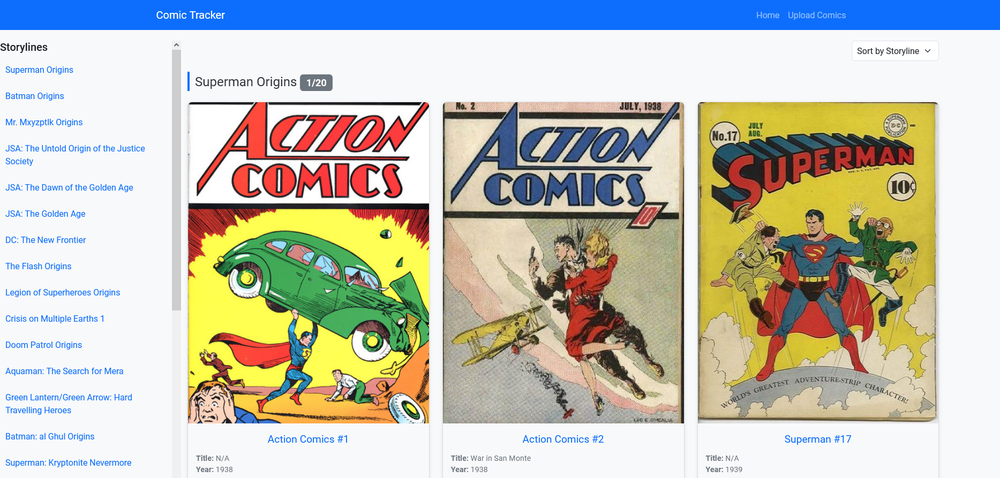
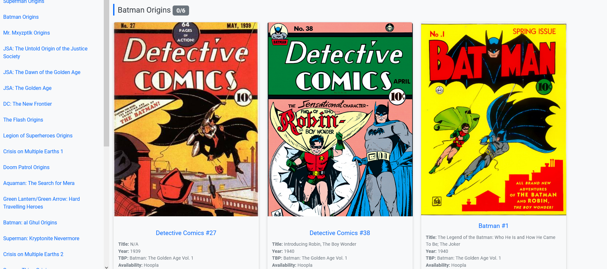
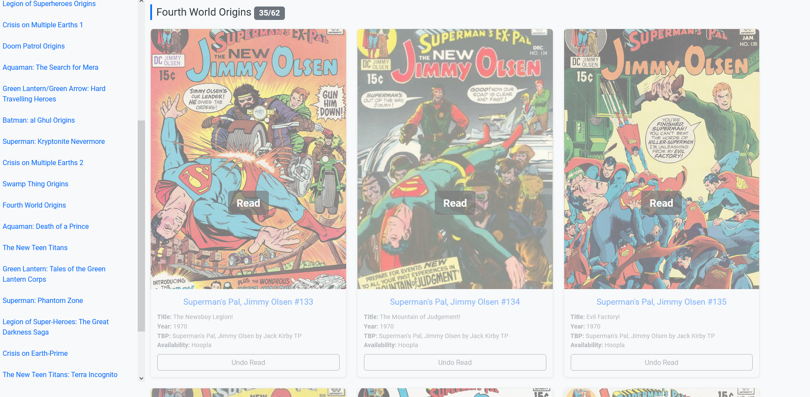

# Comic Tracker

Comic Tracker is a web-based application for managing comic book collections. It allows users to upload their collection via CSV, track the read/unread status of comics, and view them grouped by storyline or sorted by publication order.

## Features
- Upload comic collection via CSV files.
- Automatic fetching of comic details (e.g., cover image, issue title) using the Comic Vine API.
- Group comics by storyline and order them for easy reading.
- Track read/unread status of comics.
- Sorting options, including by storyline, ID, and publication year.
- Simple interface to update and view comic details.

---

## Screenshots

---

## Setup Instructions

### Prerequisites
- Python 3.7 or higher
- Flask and Flask extensions (`flask-wtf`, `flask-sqlalchemy`)
- SQLite (default database)
- A Comic Vine API key (create an account at [Comic Vine](https://comicvine.gamespot.com/api/) to get your API key)

### Installation
1. Clone the repository:
   
    git clone https://github.com/your-repo/comic-tracker.git
   
    cd comic-tracker

3. Install dependencies:
   
    pip install -r requirements.txt

5. Set environment variables in a `.env` file:
6. 

   SECRET_KEY=your_secret_key
      
   DATABASE_URI=sqlite:///comics.db
   
   COMIC_VINE_API_KEY=your_comic_vine_api_key

8. Initialize the database:
   
    python app.py

---

## Project Structure

comic-tracker/
├── app.py                  # Main Flask app

├── api_client.py           # Comic Vine API client

├── import_data.py          # Handles CSV uploads and database updates

├── models.py               # SQLAlchemy database models

├── templates/              # HTML templates for Flask views

├── static/                 # Static assets (CSS, JS, images)

├── database/               # Database initialization and configuration

├── tests/                  # Unit tests for the application

└── README.md               # This file

---

## Usage

### 1. Upload a CSV File

    • The required format for the CSV file is:

            Issue,Issue Number,Series Start Year,Issue Published Year,TBP,Availability,Storyline,Story Order,Status,cover_image_url

    • Example:

            Action Comics #1,1,1938,1938,Superman : A Celebration of 75 Years,Library,Superman Origins,1,Unread,

### 2. Viewing Comics

    • Navigate to /comics to view your uploaded comics.
    • Use the dropdown to sort comics by storyline, ID, or publication year.

### Updating Read/Unread Status
    • Click the "Mark as Read" or "Undo Read" buttons to toggle the status of a comic.

---

## Key Components
### app.py
    • Contains the main application logic:
        • Routing
        • Error handling
        • Database initialization
    • Provides routes for:
        • /comics to display comics
        • /upload to handle CSV uploads
        • /update_status/<int:comic_id> to toggle read/unread status
### api_client.py
    • Handles API calls to Comic Vine.
    • Fetches issue titles and cover images based on series name, start year, and issue number.
    • Implements rate-limiting checks to prevent API abuse.
### import_data.py
    • Processes CSV uploads to:
        • Add new comics to the database.
        • Update existing comics with new details from the CSV or API.
    • Handles validation and logging for CSV rows.
### models.py
    • Defines the Comic model for the SQLAlchemy ORM.
    • Fields:
        • id, issue, issue_number, issue_title, series_start_year, issue_published_year, etc.
    • Used to manage comic data in the database.

---

## Acknowledgements
    • Comic data provided by Comic Vine via their API.
    • Reading order inspired by Comic Book Reading Orders.
